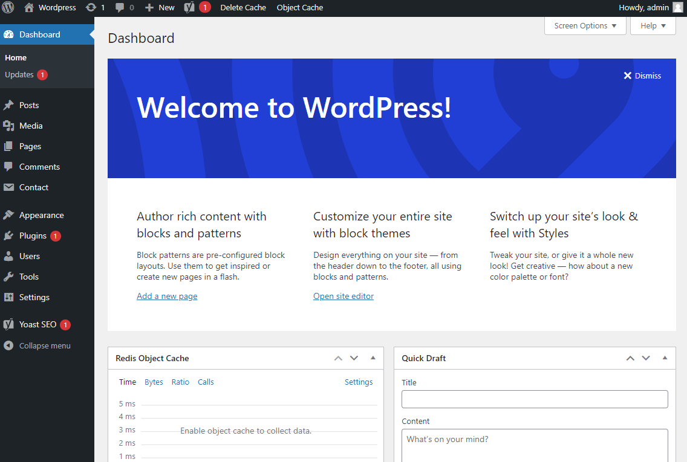

# WORDPRESS + MySQL + PhpMyAdmin docker-compose demo CI/CD pipeline

Example application and CI/CD pipeline showing how to deploy a WordPress + MySQL + PhpMyAdmin docker-compose to elestio.

 
 

# Once deployed ...

You can open the WordPress admin panel here:

    https://[CI_CD_DOMAIN]/wp-admin
    Login: [ADMIN_EMAIL] (set in env var)
    password: [ADMIN_PASSWORD] (set in env var)

You can connect to your DB through PHPMyAdmin:

    https://[CI_CD_DOMAIN]:24580/
    Login: root (set in reverse proxy configuration)
    Password: [ADMIN_PASSWORD] (set in reverse proxy configuration)

# Redis

You can activate the Redis cache by following the below steps:
1. Go to Service/Pipeline.
2. Click on Tools
3. Open Vs Code
4. Open `wp-config.php` file inside the WordPress folder.
5. Add the below both lines at the end of the `wp-config.php` file.
   
    define('WP_REDIS_HOST', '172.17.0.1');
   
    define('WP_REDIS_PORT', '6379');
   
7. Now open the WordPress application admin.
8. Go to the plugins section => installed plugins.
9. Find the `Redis Object Cache` plugin. if not found install it.
10. Click on `Settings` below `Redis Object Cache`, then click on the `Enable Object Cache` button

The Redis Object Cache plugin comes with a vast set of configuration options.

| Configuration constant               | Default     | Description                                   |
| ------------------------------------ | ----------- | --------------------------------------------- |
| `WP_REDIS_HOST`                      | `172.17.0.1` | The hostname of the Redis server |
| `WP_REDIS_PORT`                      | `6379`      | The port of the Redis server |
| `WP_REDIS_PATH`                      |             | The path to the unix socket of the Redis server |
| `WP_REDIS_SCHEME`                    | `tcp`       | The scheme used to connect: `tcp` or `unix` |
| `WP_REDIS_DATABASE`                  | `0`         | The database used by the cache: `0-15` |
| `WP_REDIS_PREFIX`                    |             | The prefix used for all cache keys to avoid data collisions (replaces `WP_CACHE_KEY_SALT`), should be human readable and not a "salt" |
| `WP_REDIS_PASSWORD`                  |             | The password of the Redis server, supports Redis ACLs arrays: `['user', 'password']` |
| `WP_REDIS_MAXTTL`                    | `0`         | The maximum time-to-live of cache keys |
| `WP_REDIS_CLIENT`                    |             | The client used to communicate with Redis (defaults to `phpredis` when installed, otherwise `predis`), supports `phpredis`, `predis`, `relay` |
| `WP_REDIS_TIMEOUT`                   | `1`         | The connection timeout in seconds |
| `WP_REDIS_READ_TIMEOUT`              | `1`         | The timeout in seconds when reading/writing |
| `WP_REDIS_IGNORED_GROUPS`            | `[]`        | Groups that should not be cached between requests in Redis |
